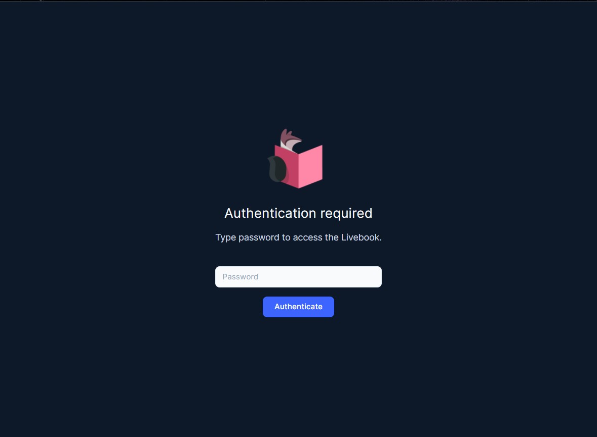
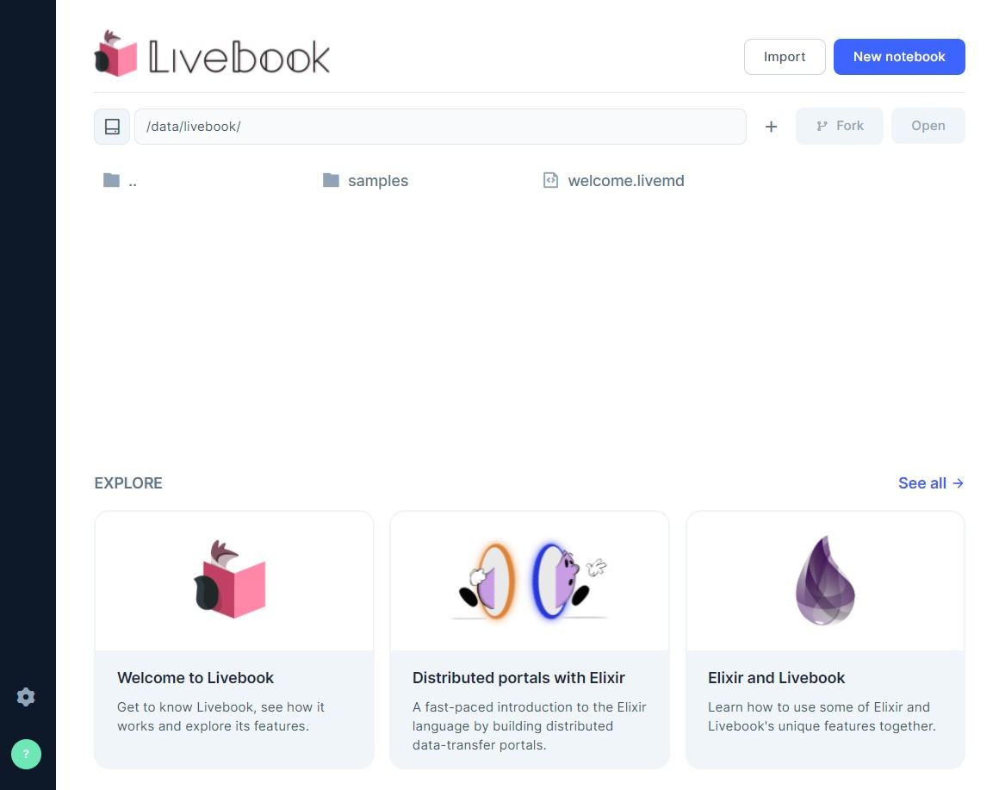
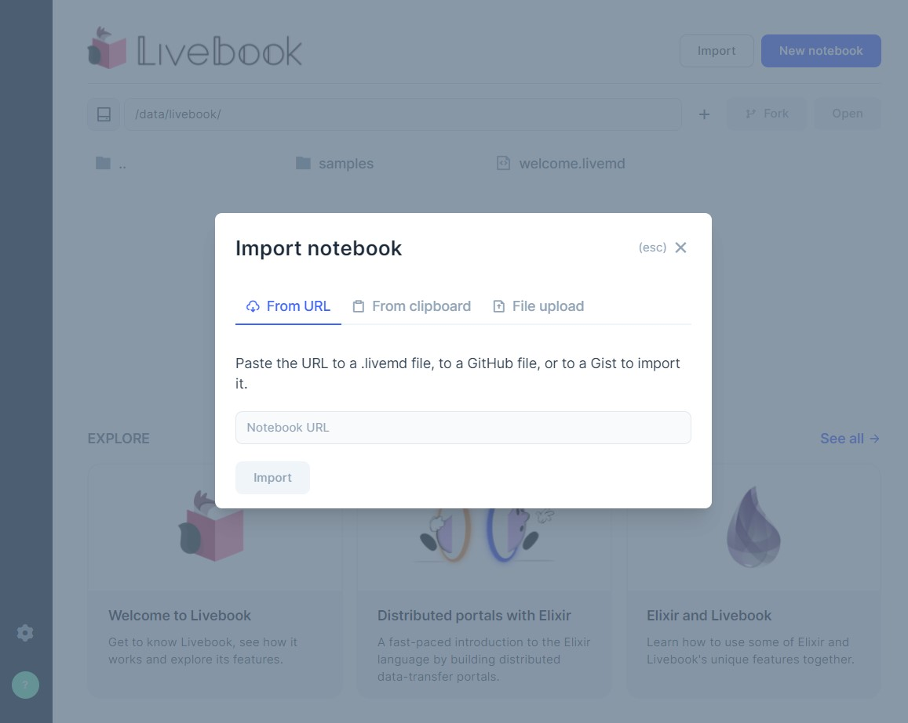
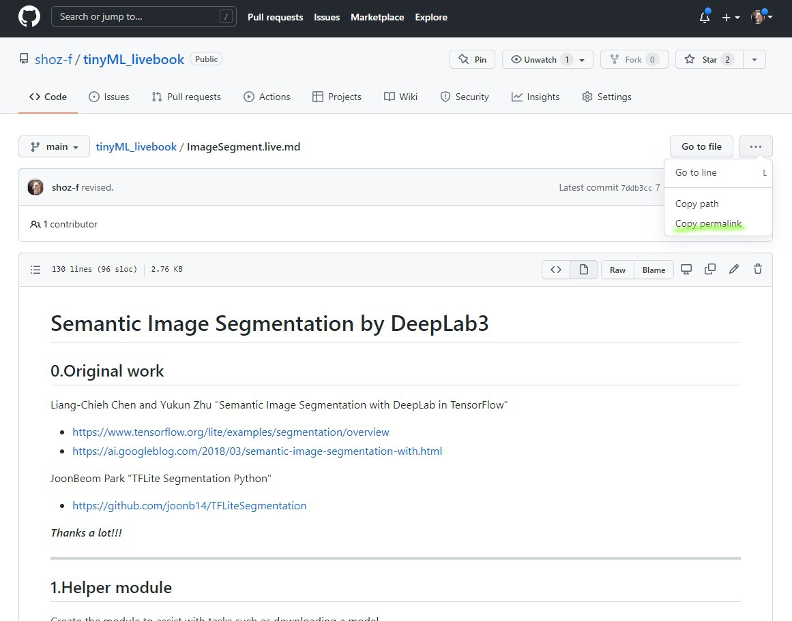
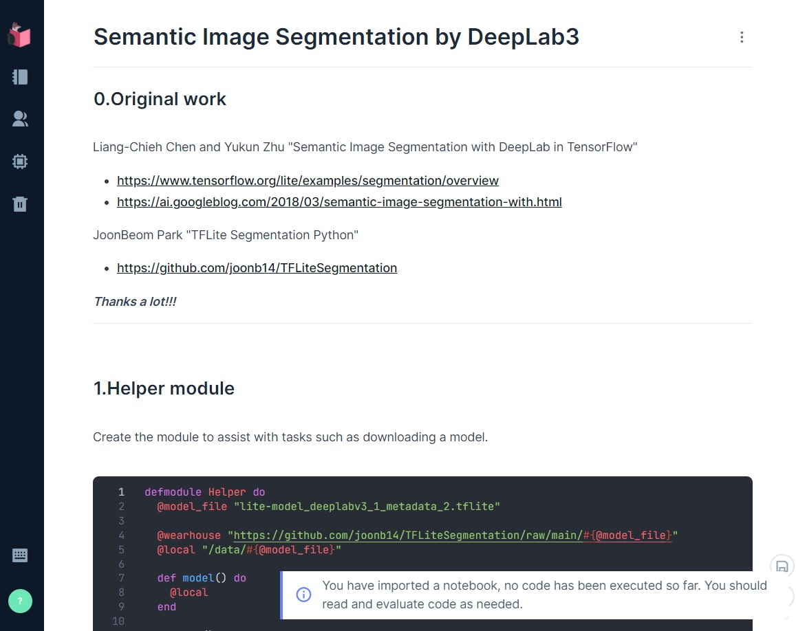

# TflInterp on Nerves

## 0.Requirement

* Raspberry Pi 3B
* Raspberry Pi Camera Module
* Host PC (MacOS, Linux, Windows/WSL2)

## 1.Setup
In order to use TflInterp on Nerves-livebook, you need to rebuild your Nerves-livebook.
First, you will clone Nerves-livebook from [Nerves Livebook Firmware](https://github.com/livebook-dev/nerves_livebook.git) GitHub.

```shell
$ git clone https://github.com/livebook-dev/nerves_livebook.git
$ cd nerves_livebook
```

Next, you add the following items to the dependency list of `mix.exs`.

```elixir
def deps do
  [
      ....
      {:tfl_interp, "~> 0.1.4"},
      {:cimg, "~> 0.1.9"},
      {:picam, "~> 0.4.0"},
  ]
end
```

As usual, you specify the target, resolve the dependencies, and then build the firmware.
Compiling TflInterp takes a few tens of minutes. Because it requires to download the Arm7NEON toolchain, TensorFlow source code, etc.

```shell
$ export MIX_TARGET=rpi3
$ mix deps.get
$ mix firmware
```

Finally, you burn the finished firmware to an SD card.

```shell
$ mix burn
```

## 2.Try out
Now, let's get it running ;-)

Insert the SD card into the Raspberry Pi 3B and turn it on.
When the LEDs on the board stop flickering, you start a browser on your PC and connect to the Nerves-livebook.

You have succeeded, if the following sign-in screen appears in your browser. 
You enter "nerves" as the password and sign in.



For starters, let's run the "sematic image segmentation" demo.
Click the "import" button in the upper right corner of the screen to load the demo code.



For the URL, enter the URL of the "Semantic Image Segmentation by DeepLab3" notebook in my GitHub/tinyMLlivebook.




After importing the "Semantic Image Segmentation with DeepLab3" notebook, you will see the following screen.
If you execute the Elixir code cells from top to bottom, you will be able to follow the "Semantic Image Segmentation" demo.



Let's enjoy ;-)

&#9633;